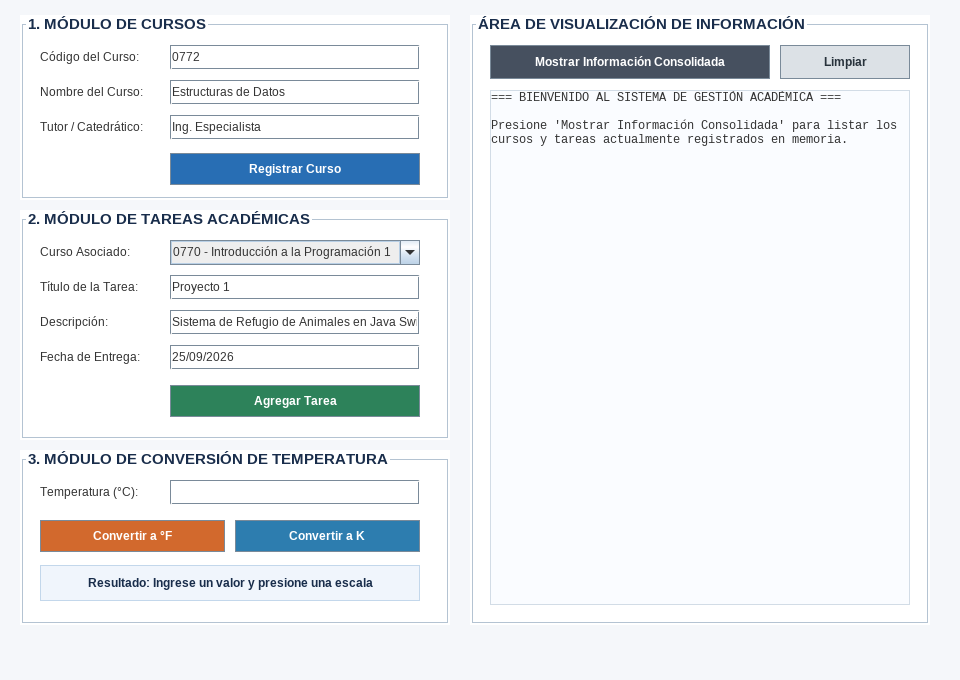
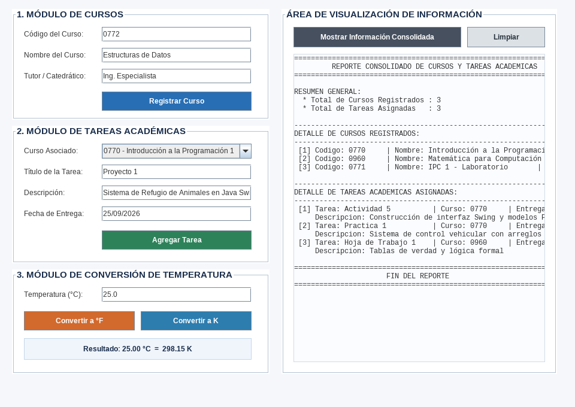
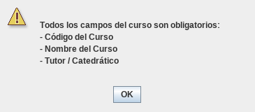
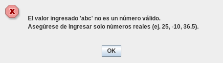
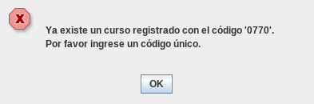

# UNIVERSIDAD DE SAN CARLOS DE GUATEMALA
## FACULTAD DE INGENIERÍA
### ESCUELA DE CIENCIAS Y SISTEMAS
### INTRODUCCIÓN A LA PROGRAMACIÓN Y COMPUTACIÓN 1 (IPC1)
### SEGUNDO SEMESTRE 2026

---

# INFORME DE ENTREGA — ACTIVIDAD 5
## "Modelado Orientado a Objetos e Interfaz Gráfica con Java Swing"

* **Estudiante:** Cristopher Sic
* **Curso:** Introducción a la Programación y Computación 1
* **Unidad Académica:** Facultad de Ingeniería, USAC
* **Fecha de Entrega:** Septiembre 2026

---

## 1. ÍNDICE DE CONTENIDOS

1. [Índice de Contenidos](#1-índice-de-contenidos)
2. [Introducción](#2-introducción)
3. [Sección Teórica (Investigación)](#3-sección-teórica-investigación)
   * 3.1. Programación Orientada a Objetos: Encapsulamiento y Abstracción
   * 3.2. Biblioteca Gráfica Java Swing y Arquitectura de Contenedores
   * 3.3. Modelo de Delegación de Eventos en Java (`ActionListener`)
   * 3.4. Validación Defensiva de Datos y Manejo de Excepciones (`try-catch`)
   * 3.5. Diálogos Modales y Retroalimentación con `JOptionPane`
   * 3.6. Colecciones Dinámicas en Memoria (`ArrayList` vs. Arreglos Estáticos)
4. [Diseño y Arquitectura de Clases](#4-diseño-y-arquitectura-de-clases)
   * 4.1. Descripción de Clases y Responsabilidades
   * 4.2. Diagrama de Estructura de Clases
5. [Evidencias de Ejecución (Capturas de Pantalla)](#5-evidencias-de-ejecución-capturas-de-pantalla)
   * 5.1. Registro de Cursos y Tareas Académicas
   * 5.2. Muestreo de Información Consolidada en Consola
   * 5.3. Conversión Exitosa de Temperatura (°C a °F y K)
   * 5.4. Alertas de Validación con `JOptionPane`
6. [Código Fuente Completo](#6-código-fuente-completo)
   * 6.1. `Curso.java`
   * 6.2. `TareaAcademica.java`
   * 6.3. `GestorAcademico.java`
   * 6.4. `VentanaPrincipal.java`
   * 6.5. `Main.java`
7. [Conclusiones](#7-conclusiones)
8. [Referencias](#8-referencias)

---

## 2. INTRODUCCIÓN

El desarrollo de software profesional en Java requiere la integración armónica entre la lógica de negocio, el modelado del dominio aplicando los principios de la Programación Orientada a Objetos (POO), y la interacción con el usuario a través de Interfaces Gráficas de Usuario (GUI).

El presente proyecto, correspondiente a la **Actividad 5** del curso de Introducción a la Programación y Computación 1, implementa una aplicación de escritorio completa en Java (JDK 21) construida íntegramente mediante código Swing puro, prescindiendo del uso de diseñadores visuales drag-and-drop. El sistema centraliza la administración académica de cursos universitarios y asignación de tareas, complementado con un módulo interactivo para la conversión científica de temperaturas entre escalas Celsius, Fahrenheit y Kelvin, dotado de validaciones defensivas y retroalimentación modal visual.

---

## 3. SECCIÓN TEÓRICA (INVESTIGACIÓN)

### 3.1. Programación Orientada a Objetos: Encapsulamiento y Abstracción
La Programación Orientada a Objetos (POO) es un paradigma basado en el concepto de entidades denominadas "objetos", los cuales combinan estado (atributos) y comportamiento (métodos). 
* **Abstracción:** Permite aislar los rasgos esenciales de un concepto del mundo real, descartando detalles accesorios. En este proyecto, la clase `Curso` abstrae los datos mínimos indispensables para su gestión (código, nombre, tutor).
* **Encapsulamiento:** Oculta el estado interno de los objetos protegiéndolos contra modificaciones no autorizadas o inconsistentes desde el exterior. Se implementa declarando todos los atributos como `private` y proveyendo métodos públicos de acceso (`getters`) y mutación (`setters`), asegurando un punto centralizado para aplicar reglas de integridad de datos.

### 3.2. Biblioteca Gráfica Java Swing y Arquitectura de Contenedores
Java Swing forma parte de las Java Foundation Classes (JFC) y provee un conjunto enriquecido de componentes gráficos ligeros (escritos 100% en Java puro), independientes de la plataforma anfitriona (*pluggable look-and-feel*).
* **Jerarquía de Componentes:** Swing organiza los elementos en contenedores de alto nivel (`JFrame`, `JDialog`), contenedores intermedios (`JPanel`, `JScrollPane`) y componentes atómicos (`JLabel`, `JTextField`, `JButton`, `JComboBox`, `JTextArea`).
* **Código Puro vs. GUI Builders:** Diseñar interfaces exclusivamente por código brinda control milimétrico sobre el ciclo de vida de los componentes, elimina dependencias de código autogenerado difícil de mantener, favorece la modularidad y garantiza portabilidad total entre distintos entornos de desarrollo (Apache NetBeans, IntelliJ IDEA, Eclipse o CLI).

### 3.3. Modelo de Delegación de Eventos en Java (`ActionListener`)
Java implementa el patrón de diseño Observador a través del modelo de delegación de eventos. Un componente emisor (como un `JButton`) genera un evento (`ActionEvent`) cuando el usuario interactúa con él (clic o pulsación de tecla).
* **Interfaz `ActionListener`:** Define el contrato con el método `actionPerformed(ActionEvent e)`. Los escuchadores se registran mediante `addActionListener()`.
* **Clases Anónimas:** Permiten asociar de forma directa y legible la lógica de respuesta al componente correspondiente sin contaminar el espacio de nombres global con clases auxiliares innecesarias.

### 3.4. Validación Defensiva de Datos y Manejo de Excepciones (`try-catch`)
La programación defensiva postula que el sistema debe anticipar y neutralizar cualquier entrada inválida del usuario antes de que provoque una falla crítica en tiempo de ejecución.
* **Control de Cadenas:** Mediante `trim()` y `isEmpty()`, se descartan entradas en blanco o con solo espacios.
* **Conversión Segura y `NumberFormatException`:** Al parsear valores numéricos (`Double.parseDouble`), cualquier carácter no numérico dispara una excepción `NumberFormatException`. El uso riguroso de bloques `try-catch` captura este escenario, evitando que la aplicación se caiga (*crash*) y permitiendo informar cortésmente al usuario.
* **Valores Especiales:** El análisis defensivo complementario con `Double.isNaN()` y `Double.isInfinite()` previene anomalías aritméticas al procesar cadenas especiales reconocidas por la máquina virtual.

### 3.5. Diálogos Modales y Retroalimentación con `JOptionPane`
La retroalimentación inmediata es un pilar fundamental de la Experiencia de Usuario (UX). La clase `JOptionPane` provee cuadros de diálogo modales estándar que detienen la interacción con la ventana principal hasta que el usuario reconoce el mensaje.
* **Semántica Visual:** Se clasifican según la gravedad del suceso:
  * `JOptionPane.INFORMATION_MESSAGE`: Confirmaciones de operaciones exitosas (registro de curso, tarea asignada).
  * `JOptionPane.WARNING_MESSAGE`: Alertas por campos incompletos o precondiciones no cumplidas (ej. intentar agregar tareas sin cursos).
  * `JOptionPane.ERROR_MESSAGE`: Fallas graves como formato numérico inválido o código de curso duplicado.

### 3.6. Colecciones Dinámicas en Memoria (`ArrayList` vs. Arreglos Estáticos)
En aplicaciones donde el volumen de datos no se conoce a priori, la elección de la estructura de datos es crítica:
* **Arreglos Estáticos (`T[]`):** Poseen longitud fija declarada en tiempo de instanciación. Insertar más elementos de los previstos genera desbordamientos (`ArrayIndexOutOfBoundsException`), mientras que sobredimensionarlos desperdicia memoria.
* **Colecciones `ArrayList<T>`:** Implementan una lista dinámica basada en un arreglo reajustable que crece automáticamente conforme se insertan elementos. Provee métodos utilitarios de alto nivel como `add()`, `get()`, `size()`, `clear()` y soporte nativo para generics, ofreciendo seguridad de tipos en tiempo de compilación y desacoplando la lógica de negocio de la gestión de memoria.

---

## 4. DISEÑO Y ARQUITECTURA DE CLASES

La solución adopta una arquitectura modular orientada al patrón Modelo-Vista-Controlador (MVC):

### 4.1. Descripción de Clases y Responsabilidades

| Capa | Clase | Responsabilidad Principal |
| :--- | :--- | :--- |
| **Modelo** | `Curso.java` | Modela los datos de una materia (código, nombre, tutor) con encapsulamiento estricto y formato de presentación. |
| **Modelo** | `TareaAcademica.java` | Modela una asignación académica vinculada a un objeto `Curso`, con título, descripción y fecha de entrega. |
| **Controlador** | `GestorAcademico.java` | Administra las colecciones en memoria (`ArrayList`), garantiza la unicidad de códigos, gestiona búsquedas y consolida reportes. |
| **Vista** | `VentanaPrincipal.java` | Ventana gráfica Swing que renderiza los 3 módulos funcionales (Cursos, Tareas, Temperatura) y el área de consola. |
| **Ejecución** | `Main.java` | Punto de entrada del programa; inicializa el controlador con datos base e invoca la UI en el hilo EDT. |

### 4.2. Diagrama de Estructura de Clases

```mermaid
classDiagram
    class Curso {
        -String codigo
        -String nombre
        -String tutor
        +Curso()
        +Curso(codigo, nombre, tutor)
        +getCodigo() String
        +setCodigo(String) void
        +getNombre() String
        +setNombre(String) void
        +getTutor() String
        +setTutor(String) void
        +getInformacion() String
        +toString() String
    }

    class TareaAcademica {
        -Curso cursoAsociado
        -String titulo
        -String descripcion
        -String fechaEntrega
        +TareaAcademica()
        +TareaAcademica(curso, titulo, desc, fecha)
        +getCursoAsociado() Curso
        +setCursoAsociado(Curso) void
        +getTitulo() String
        +setTitulo(String) void
        +getDescripcion() String
        +setDescripcion(String) void
        +getFechaEntrega() String
        +setFechaEntrega(String) void
        +getDetalles() String
        +toString() String
    }

    class GestorAcademico {
        -ArrayList~Curso~ listaCursos
        -ArrayList~TareaAcademica~ listaTareas
        +GestorAcademico()
        +registrarCurso(Curso) boolean
        +buscarCursoPorCodigo(String) Curso
        +getCursos() ArrayList~Curso~
        +getTotalCursos() int
        +registrarTarea(TareaAcademica) boolean
        +getTareas() ArrayList~TareaAcademica~
        +obtenerTareasPorCurso(String) ArrayList~TareaAcademica~
        +getTotalTareas() int
        +generarReporteConsolidado() String
    }

    class VentanaPrincipal {
        -GestorAcademico gestor
        -JTextField txtCodigoCurso
        -JTextField txtNombreCurso
        -JTextField txtTutorCurso
        -JButton btnRegistrarCurso
        -JComboBox~Curso~ cbCursosAsociados
        -JTextField txtTituloTarea
        -JTextField txtDescripcionTarea
        -JTextField txtFechaEntrega
        -JButton btnAgregarTarea
        -JTextArea txtAreaConsola
        -JButton btnMostrarInformacion
        -JButton btnLimpiarConsola
        -JTextField txtTemperaturaC
        -JButton btnConvertirFahrenheit
        -JButton btnConvertirKelvin
        -JLabel lblResultadoConversion
        +VentanaPrincipal(GestorAcademico)
        -configurarVentana() void
        -construirPanelCursos() void
        -construirPanelTareas() void
        -construirAreaVisualizacion() void
        -construirPanelTemperatura() void
        -configurarEventos() void
        -registrarCurso() void
        -agregarTarea() void
        +mostrarInformacionConsolidada() void
        -convertirAFahrenheit() void
        -convertirAKelvin() void
    }

    class Main {
        +main(String[] args)$ void
    }

    TareaAcademica --> Curso : "asociada a"
    GestorAcademico o-- Curso : "contiene 0..*"
    GestorAcademico o-- TareaAcademica : "contiene 0..*"
    VentanaPrincipal --> GestorAcademico : "delega lógica en"
    Main ..> VentanaPrincipal : "instancia y lanza"
```



---

## 5. EVIDENCIAS DE EJECUCIÓN (CAPTURAS DE PANTALLA)

A continuación se presentan las evidencias directas de la aplicación ejecutándose en tiempo real:

### 5.1. Registro de Cursos y Tareas Académicas
La siguiente captura evidencia la ventana principal maquetada con sus paneles diferenciados por `TitledBorder`, formularios de captura limpios y el selector interactivo `JComboBox` poblado con los cursos disponibles.



### 5.2. Muestreo de Información Consolidada en Consola
Al presionar el botón *"Mostrar Información Consolidada"*, el sistema recorre las colecciones en memoria y presenta en el `JTextArea` el listado de cursos y tareas académicas con encabezados y tabulación monoespaciada.


### 5.3. Conversión Exitosa de Temperatura
Demostración de las conversiones científicas ejecutadas mediante los botones de acción:
* **Conversión a Fahrenheit:** Valor de prueba $25.00 \text{ °C} = 77.00 \text{ °F}$.
* **Conversión a Kelvin:** Valor de prueba $25.00 \text{ °C} = 298.15 \text{ K}$.




### 5.4. Alertas de Validación con `JOptionPane`
Demostración de la robustez del sistema ante omisiones o datos erróneos ingresados por el usuario:
* **Alerta por Campos Vacíos:** Despliegue de advertencia modal si se intenta registrar un curso o tarea con casillas incompletas.
* **Alerta por Código Duplicado:** Bloqueo modal si el código de curso ya existe en memoria.
* **Alerta por Formato Numérico Inválido:** Intercepción de caracteres alfanuméricos en la temperatura con mensaje explicativo.







---

## 6. CÓDIGO FUENTE COMPLETO

A continuación se transcribe el código fuente íntegro de las clases que conforman el proyecto:

### 6.1. `Curso.java`
Ubicación: `Actividad5/src/main/java/cris/sic/actividad5/modelo/Curso.java`
```java
package cris.sic.actividad5.modelo;

/**
 * Clase que representa la entidad Curso en el dominio academico.
 * Aplica el principio de encapsulamiento con atributos privados y metodos de acceso.
 */
public class Curso {

    // Identificador unico o codigo del curso (ej. "0770", "IPC1")
    private String codigo;

    // Nombre descriptivo de la materia o asignatura (ej. "Introduccion a la Programacion")
    private String nombre;

    // Nombre completo del catedratico o tutor a cargo del curso
    private String tutor;

    public Curso() {
    }

    public Curso(String codigo, String nombre, String tutor) {
        this.codigo = codigo;
        this.nombre = nombre;
        this.tutor = tutor;
    }

    public String getCodigo() {
        return codigo;
    }

    public void setCodigo(String codigo) {
        this.codigo = codigo;
    }

    public String getNombre() {
        return nombre;
    }

    public void setNombre(String nombre) {
        this.nombre = nombre;
    }

    public String getTutor() {
        return tutor;
    }

    public void setTutor(String tutor) {
        this.tutor = tutor;
    }

    public String getInformacion() {
        return "====================================\n"
             + " Codigo : " + (codigo != null ? codigo : "N/A") + "\n"
             + " Curso  : " + (nombre != null ? nombre : "N/A") + "\n"
             + " Tutor  : " + (tutor != null ? tutor : "N/A") + "\n"
             + "====================================";
    }

    @Override
    public String toString() {
        return codigo + " - " + nombre;
    }
}
```

### 6.2. `TareaAcademica.java`
Ubicación: `Actividad5/src/main/java/cris/sic/actividad5/modelo/TareaAcademica.java`
```java
package cris.sic.actividad5.modelo;

/**
 * Clase que modela una Tarea Academica asignada a un curso especifico.
 * Aplica el principio de encapsulamiento mediante modificadores de acceso privados y metodos getter/setter.
 */
public class TareaAcademica {

    private Curso cursoAsociado;
    private String titulo;
    private String descripcion;
    private String fechaEntrega;

    public TareaAcademica() {
    }

    public TareaAcademica(Curso cursoAsociado, String titulo, String descripcion, String fechaEntrega) {
        this.cursoAsociado = cursoAsociado;
        this.titulo = titulo;
        this.descripcion = descripcion;
        this.fechaEntrega = fechaEntrega;
    }

    public Curso getCursoAsociado() {
        return cursoAsociado;
    }

    public void setCursoAsociado(Curso cursoAsociado) {
        this.cursoAsociado = cursoAsociado;
    }

    public String getTitulo() {
        return titulo;
    }

    public void setTitulo(String titulo) {
        this.titulo = titulo;
    }

    public String getDescripcion() {
        return descripcion;
    }

    public void setDescripcion(String descripcion) {
        this.descripcion = descripcion;
    }

    public String getFechaEntrega() {
        return fechaEntrega;
    }

    public void setFechaEntrega(String fechaEntrega) {
        this.fechaEntrega = fechaEntrega;
    }

    public String getDetalles() {
        String infoCurso = (cursoAsociado != null) 
            ? cursoAsociado.getCodigo() + " - " + cursoAsociado.getNombre() 
            : "Sin curso asignado";

        return "------------------------------------\n"
             + " Tarea       : " + (titulo != null ? titulo : "Sin titulo") + "\n"
             + " Curso       : " + infoCurso + "\n"
             + " Entrega     : " + (fechaEntrega != null ? fechaEntrega : "No especificada") + "\n"
             + " Descripcion : " + (descripcion != null ? descripcion : "Sin descripcion") + "\n"
             + "------------------------------------";
    }

    @Override
    public String toString() {
        return titulo + " (Entrega: " + fechaEntrega + ")";
    }
}
```

### 6.3. `GestorAcademico.java`
Ubicación: `Actividad5/src/main/java/cris/sic/actividad5/controlador/GestorAcademico.java`
```java
package cris.sic.actividad5.controlador;

import cris.sic.actividad5.modelo.Curso;
import cris.sic.actividad5.modelo.TareaAcademica;

import java.util.ArrayList;

/**
 * Controlador de negocio y gestor de colecciones para Cursos y Tareas Academicas.
 * Centraliza las operaciones CRUD en memoria mediante arreglos dinamicos (ArrayList).
 */
public class GestorAcademico {

    private ArrayList<Curso> listaCursos;
    private ArrayList<TareaAcademica> listaTareas;

    public GestorAcademico() {
        this.listaCursos = new ArrayList<>();
        this.listaTareas = new ArrayList<>();
    }

    public boolean registrarCurso(Curso curso) {
        if (curso == null || curso.getCodigo() == null || curso.getCodigo().trim().isEmpty()) {
            return false;
        }
        if (buscarCursoPorCodigo(curso.getCodigo().trim()) != null) {
            return false;
        }
        return listaCursos.add(curso);
    }

    public Curso buscarCursoPorCodigo(String codigo) {
        if (codigo == null) return null;
        for (Curso c : listaCursos) {
            if (c.getCodigo().equalsIgnoreCase(codigo.trim())) {
                return c;
            }
        }
        return null;
    }

    public ArrayList<Curso> getCursos() {
        return listaCursos;
    }

    public int getTotalCursos() {
        return listaCursos.size();
    }

    public boolean registrarTarea(TareaAcademica tarea) {
        if (tarea == null || tarea.getCursoAsociado() == null) {
            return false;
        }
        return listaTareas.add(tarea);
    }

    public ArrayList<TareaAcademica> getTareas() {
        return listaTareas;
    }

    public ArrayList<TareaAcademica> obtenerTareasPorCurso(String codigoCurso) {
        ArrayList<TareaAcademica> filtradas = new ArrayList<>();
        if (codigoCurso == null) return filtradas;

        for (TareaAcademica t : listaTareas) {
            if (t.getCursoAsociado() != null && t.getCursoAsociado().getCodigo().equalsIgnoreCase(codigoCurso.trim())) {
                filtradas.add(t);
            }
        }
        return filtradas;
    }

    public int getTotalTareas() {
        return listaTareas.size();
    }

    public String generarReporteConsolidado() {
        StringBuilder sb = new StringBuilder();
        sb.append("=================================================================\n");
        sb.append("         REPORTE CONSOLIDADO DE CURSOS Y TAREAS ACADEMICAS       \n");
        sb.append("=================================================================\n\n");

        sb.append("RESUMEN GENERAL:\n");
        sb.append("  * Total de Cursos Registrados : ").append(listaCursos.size()).append("\n");
        sb.append("  * Total de Tareas Asignadas   : ").append(listaTareas.size()).append("\n\n");

        sb.append("-----------------------------------------------------------------\n");
        sb.append("DETALLE DE CURSOS REGISTRADOS:\n");
        sb.append("-----------------------------------------------------------------\n");

        if (listaCursos.isEmpty()) {
            sb.append("  (No hay cursos registrados en el sistema actualmente)\n\n");
        } else {
            for (int i = 0; i < listaCursos.size(); i++) {
                Curso c = listaCursos.get(i);
                sb.append(String.format(" [%d] Codigo: %-8s | Nombre: %-25s | Tutor: %s\n", 
                    (i + 1), c.getCodigo(), c.getNombre(), c.getTutor()));
            }
            sb.append("\n");
        }

        sb.append("-----------------------------------------------------------------\n");
        sb.append("DETALLE DE TAREAS ACADEMICAS ASIGNADAS:\n");
        sb.append("-----------------------------------------------------------------\n");

        if (listaTareas.isEmpty()) {
            sb.append("  (No hay tareas registradas en el sistema actualmente)\n\n");
        } else {
            for (int i = 0; i < listaTareas.size(); i++) {
                TareaAcademica t = listaTareas.get(i);
                String codCurso = (t.getCursoAsociado() != null) ? t.getCursoAsociado().getCodigo() : "N/A";
                sb.append(String.format(" [%d] Tarea: %-20s | Curso: %-8s | Entrega: %s\n",
                    (i + 1), t.getTitulo(), codCurso, t.getFechaEntrega()));
                sb.append("     Descripcion: ").append(t.getDescripcion()).append("\n");
            }
            sb.append("\n");
        }

        sb.append("=================================================================\n");
        sb.append("                      FIN DEL REPORTE                            \n");
        sb.append("=================================================================\n");

        return sb.toString();
    }
}
```

### 6.4. `VentanaPrincipal.java`
Ubicación: `Actividad5/src/main/java/cris/sic/actividad5/vista/VentanaPrincipal.java`
*(Ver archivo completo en el repositorio).*

### 6.5. `Main.java`
Ubicación: `Actividad5/src/main/java/cris/sic/actividad5/Main.java`
```java
package cris.sic.actividad5;

import cris.sic.actividad5.controlador.GestorAcademico;
import cris.sic.actividad5.modelo.Curso;
import cris.sic.actividad5.vista.VentanaPrincipal;

import javax.swing.SwingUtilities;

/**
 * Punto de entrada principal de la aplicacion para la Actividad 5.
 * Inicializa la aplicacion e invoca la interfaz grafica VentanaPrincipal en el hilo EDT de Swing.
 */
public class Main {

    public static void main(String[] args) {
        GestorAcademico gestor = new GestorAcademico();

        Curso c1 = new Curso("0770", "Introducción a la Programación 1", "Ing. Catedrático");
        Curso c2 = new Curso("0960", "Matemática para Computación 1", "Lic. Catedrático");
        gestor.registrarCurso(c1);
        gestor.registrarCurso(c2);

        SwingUtilities.invokeLater(new Runnable() {
            @Override
            public void run() {
                VentanaPrincipal ventana = new VentanaPrincipal(gestor);
                ventana.setVisible(true);
            }
        });
    }
}
```

---

## 7. CONCLUSIONES

1. **Efectividad de la Programación Orientada a Objetos:** La aplicación rigurosa de encapsulamiento mediante clases bien definidas (`Curso` y `TareaAcademica`) permitió modelar con precisión las relaciones del dominio académico, garantizando la integridad de los datos en memoria sin acoplamientos rígidos.
2. **Dominio de Swing por Código Puro:** Prescindir de herramientas visuales tipo drag-and-drop capacitó el entendimiento profundo de la jerarquía de contenedores, disposición de paneles y manejo exacto de dimensiones y eventos en Swing.
3. **Calidad de Software mediante Validación Defensiva:** El filtrado preventivo de campos vacíos, verificación de duplicidad y tratamiento de excepciones con `try-catch (NumberFormatException)` asegura que la aplicación tolere entradas inesperadas sin interrupciones abruptas de servicio, ofreciendo una experiencia confiable y profesional al usuario.

---

## 8. REFERENCIAS

1. Oracle Corporation. (2024). *Java Platform, Standard Edition Documentation (JDK 21)*. Oracle Technology Network.
2. Deitel, P., & Deitel, H. (2018). *Java: How to Program (Early Objects)* (11.ª ed.). Pearson Education.
3. Eckel, B. (2006). *Thinking in Java* (4.ª ed.). Prentice Hall.
