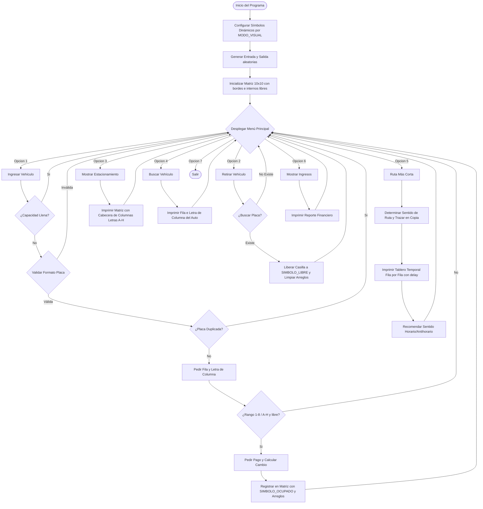

# Manual Técnico - Sistema de Estacionamiento (UI/UX Avanzada)

Este documento detalla el diseño de software, la arquitectura de datos, los algoritmos implementados y la lógica de programación del Sistema de Estacionamiento de la Práctica 1 (Versión Actualizada con UI/UX Avanzada).

---

## 1. Arquitectura de Datos y Estado Global

Para cumplir estrictamente con la restricción de **no utilizar colecciones dinámicas** (`ArrayList`, `HashMap`, etc.), el estado del sistema se administra mediante arreglos primitivos estáticos y paralelos de tamaño fijo.

### Estructuras de Datos
* **Tablero Principal (`char[][] tablero`):** Matriz de $10 \times 10$ que representa el espacio físico del parqueo.
  * Bordes perimetrales: representados con el carácter `'='`.
  * Entrada y Salida: representadas por `'E'` y `'S'` respectivamente en posiciones aleatorias del perímetro.
  * Espacio libre interno: representado por `SIMBOLO_LIBRE` (dinámico) en el área de $8 \times 8$.
  * Vehículo estacionado: representado por `SIMBOLO_OCUPADO` (dinámico).
* **Arreglo de Placas (`String[] placas`):** Arreglo unidimensional de tamaño 64 que almacena las placas registradas.
* **Arreglo de Filas (`int[] filasVehiculos`):** Guarda la coordenada de fila ($1$ a $8$) correspondiente al vehículo.
* **Arreglo de Columnas (`int[] columnasVehiculos`):** Guarda la coordenada de columna ($1$ a $8$) correspondiente al vehículo.

### Variables Globales de Configuración Visual
* `MODO_VISUAL`: Variable estática entera que define el tema visual de la consola:
  * `1` - **Oficial**: `'L'` (libre), `'A'` (ocupado)
  * `2` - **Minimalista**: `'.'` (libre), `'X'` (ocupado)
  * `3` - **Matriarcal**: `'O'` (libre), `'#'` (ocupado)
  * `4` - **Celdas Nativas**: `'░'` (libre), `'█'` (ocupado)
* `SIMBOLO_LIBRE` y `SIMBOLO_OCUPADO`: Variables tipo `char` inicializadas en tiempo de ejecución de acuerdo a la selección de `MODO_VISUAL`.

### Variables de Control
* `contadorActivos`: Registra el número actual de vehículos estacionados (Límite: 64).
* `totalCobrados`: Contador histórico del número de transacciones realizadas.
* `totalRecaudado`: Suma acumulativa de ingresos totales en Quetzales (Q10.00 por transacción).

---

## 2. Descripción de Métodos y Funciones

### `main(String[] args)`
Punto de entrada de la aplicación. Orquesta la inicialización llamando a `configurarModoVisual()`, `generarEntradaSalida()`, `inicializarTablero()` y posteriormente levantando el menú interactivo con `desplegarMenu()`.

### `configurarModoVisual()`
Evalúa el valor de `MODO_VISUAL` y asigna dinámicamente los caracteres para `SIMBOLO_LIBRE` y `SIMBOLO_OCUPADO`.

### `limpiarPantalla()`
Invoca el comando nativo `clear` en sistemas Linux/Zorin OS mediante `ProcessBuilder` para limpiar la terminal, brindando una experiencia de usuario limpia y libre de acumulaciones de texto.

### `pausaLenta(int ms)`
Introduce retardos temporales usando `Thread.sleep` para controlar la velocidad de impresión y generar efectos animados en consola.

### `esperarEnter(Scanner scanner)`
Congela la pantalla para que el usuario pueda visualizar la información antes de ser limpiada de forma automática al presionar la tecla `ENTER`.

### `columnaLetraAIndice(char letra)`
Recibe la entrada alfanumérica de la columna (`A`-`H` o `a`-`h`) y la mapea a un índice entero del 1 al 8 de forma segura.

### `columnaIndiceALetra(int col)`
Traduce un índice numérico de columna del 1 al 8 a su equivalente en carácter de letra mayúscula (`A`-`H`) para propósitos de presentación visual.

### `validarPlaca(String placa)`
Implementa la validación del patrón de placa `P###LLL` mediante evaluaciones de caracteres:
1. Comprueba que el largo sea exactamente de 7 caracteres.
2. Comprueba que el primer carácter sea la letra `'P'`.
3. Comprueba que los índices 1 a 3 sean dígitos del `'0'` al `'9'`.
4. Comprueba que los índices 4 a 6 sean letras mayúsculas del `'A'` al `'Z'`.

### `ingresarVehiculo(Scanner scanner)`
Gestiona el flujo completo de registro de un auto:
1. Verifica capacidad del parqueo.
2. Solicita y valida la placa.
3. Solicita la fila ($1$-$8$) y columna (`A`-`H`), mapeando e indexándola.
4. Realiza el proceso de cobro de tarifa fija `Q10.00` exigiendo montos válidos.
5. Inserta el vehículo en la matriz con `SIMBOLO_OCUPADO` y registra los datos en los arreglos paralelos.

### `retirarVehiculo(Scanner scanner)`
Busca un vehículo por placa, si lo encuentra libera el espacio en el tablero regresándolo a `SIMBOLO_LIBRE`, borra sus registros en los arreglos paralelos y decrementa el conteo de vehículos activos. Presenta la columna retirada como su respectivo carácter de letra.

### `obtenerIndicePerimetral(int fila, int col)`
Mapea una coordenada física de los bordes `(fila, col)` a un índice numérico lineal perimetral de $0$ a $35$ (sentido horario), útil para el algoritmo de ruta corta.

### `obtenerCoordenadasDeIndicePerimetral36(int idx)`
Realiza la operación inversa a `obtenerIndicePerimetral`, traduciendo un número de posición de 0 a 35 en coordenadas físicas bidimensionales `(fila, col)` en la matriz de 10x10.

### `marcarRutaEnCopia(char[][] copia, int idx)`
Recibe la copia temporal del tablero y asigna el trazo visual de la ruta según la posición perimetral:
* Esquinas `(0,0), (0,9), (9,0), (9,9)` $\rightarrow$ se marcan con `+`.
* Bordes horizontales (filas 0 y 9) $\rightarrow$ se marcan con `-`.
* Bordes verticales (columnas 0 y 9) $\rightarrow$ se marcan con `|`.
* Respeta y no sobrescribe los caracteres `'E'` y `'S'`.

### `imprimirTableroAnimado(char[][] mat)`
Imprime el tablero de ruta temporal fila por fila, aplicando una pausa controlada de 100 ms entre cada una de ellas para generar un efecto visual de renderizado animado en tiempo real.

### `calcularRutaCorta(Scanner scanner)`
Determina la dirección óptima perimetral (horario vs antihorario), dibuja el camino recorrido en un tablero temporal, invoca a `imprimirTableroAnimado()` y le presenta el reporte de distancias al usuario.

---

## 3. Algoritmo Perimetral - Visualización

El perímetro de la matriz de $10 \times 10$ consta de 36 posiciones indexadas linealmente del 0 al 35 en sentido horario comenzando en la esquina superior izquierda (0,0):

```text
    0    1    2    3    4    5    6    7    8    9 (Índice perimetral)
  (0,0)(0,1)(0,2)(0,3)(0,4)(0,5)(0,6)(0,7)(0,8)(0,9)  <-- Fila 0
35(1,0)                                         (1,9)10
34(2,0)                                         (2,9)11
33(3,0)                 Matriz                  (3,9)12
32(4,0)                 Interna                 (4,9)13
31(5,0)                  (8x8)                  (5,9)14
30(6,0)                                         (6,9)15
29(7,0)                                         (7,9)16
28(8,0)                                         (8,9)17
  (9,0)(9,1)(9,2)(9,3)(9,4)(9,5)(9,6)(9,7)(9,8)(9,9)  <-- Fila 9
   27   26   25   24   23   22   21   20   19   18 (Índice perimetral)
```

---

## 4. Diagrama de Flujo del Sistema



---

## 5. Bitácora de Desarrollo

* **Problema Encontrado:** Al ejecutar la aplicación desde la consola interna de NetBeans IDE, se imprimía de forma recurrente el mensaje de error: `"TERM environment variable not set."` al intentar limpiar la pantalla.
  * **Causa:** El comando de sistema operativo `clear` requiere que la variable de entorno `TERM` esté configurada para saber cómo realizar el borrado de la terminal. Los entornos integrados (IDEs) como NetBeans no la definen en su salida estándar de ejecución.
  * **Solución:** Se modificó el método `limpiarPantalla()` en [Practica1.java](file:///home/cris_sic/Desktop/00. IPC1-2s26/Practica1/src/main/java/cris/sic/estacionamiento/Practica1.java) para inspeccionar la variable de entorno `System.getenv("TERM")`. Si no está configurada o se encuentra vacía, el sistema recurre a una limpieza simulada mediante saltos de línea, evitando que aparezcan mensajes de error y manteniendo la interfaz limpia. Si se ejecuta desde una terminal de consola real, se ejecuta el comando `clear` nativo de manera exitosa.

