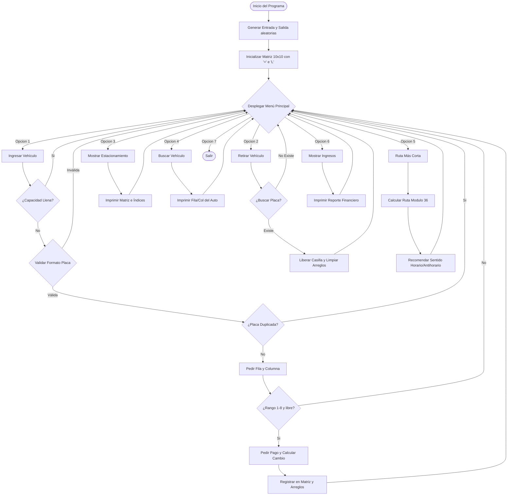

# Manual Técnico - Sistema de Estacionamiento

Este documento detalla el diseño de software, la arquitectura de datos, los algoritmos implementados y la lógica de programación del Sistema de Estacionamiento de la Práctica 1.

---

## 1. Arquitectura de Datos y Estado Global

Para cumplir estrictamente con la restricción de **no utilizar colecciones dinámicas** (`ArrayList`, `HashMap`, etc.), el estado del sistema se administra mediante arreglos primitivos estáticos y paralelos de tamaño fijo.

### Estructuras de Datos
* **Tablero Principal (`char[][] tablero`):** Matriz de $10 \times 10$ que representa el espacio físico del parqueo.
  * Bordes perimetrales: representados con el carácter `'='`.
  * Entrada y Salida: representadas por `'E'` y `'S'` respectivamente en posiciones aleatorias del perímetro.
  * Espacio libre interno: representado por `'L'` en el área de $8 \times 8$.
  * Vehículo estacionado: representado por `'A'`.
* **Arreglo de Placas (`String[] placas`):** Arreglo unidimensional de tamaño 64 que almacena las placas registradas de forma contigua.
* **Arreglo de Filas (`int[] filasVehiculos`):** Guarda la coordenada de fila ($1$ a $8$) correspondiente al vehículo en el mismo índice del arreglo de placas.
* **Arreglo de Columnas (`int[] columnasVehiculos`):** Guarda la coordenada de columna ($1$ a $8$) correspondiente al vehículo en el mismo índice del arreglo de placas.

### Variables de Control
* `contadorActivos`: Registra el número actual de vehículos estacionados (Límite: 64).
* `totalCobrados`: Contador histórico del número de transacciones realizadas.
* `totalRecaudado`: Suma acumulativa de ingresos totales en Quetzales (Q10.00 por transacción).

---

## 2. Descripción de Métodos y Funciones

### `main(String[] args)`
Punto de entrada de la aplicación. Orquesta la inicialización llamando a `generarEntradaSalida()`, `inicializarTablero()` y posteriormente levantando el menú interactivo con `desplegarMenu()`.

### `generarEntradaSalida()`
Genera dos índices perimetrales aleatorios y no coincidentes (en el rango de 0 a 31) que garantizan ubicaciones en el perímetro excluyendo las cuatro esquinas principales. Posteriormente asigna estas posiciones a las variables de Entrada y Salida.

### `obtenerCoordenadasPerimetrales(int idx, boolean esEntrada)`
Traduce un índice perimetral lineal de $0$ a $31$ en coordenadas bidimensionales de matriz `(fila, col)` correspondientes:
* `idx` de 0 a 7 $\rightarrow$ Fila 0, Columnas 1 a 8.
* `idx` de 8 a 15 $\rightarrow$ Filas 1 a 8, Columna 9.
* `idx` de 16 a 23 $\rightarrow$ Fila 9, Columnas 1 a 8.
* `idx` de 24 a 31 $\rightarrow$ Filas 1 a 8, Columna 0.

### `validarPlaca(String placa)`
Implementa la validación del patrón de placa `P###LLL` mediante evaluaciones de caracteres:
1. Comprueba que el largo sea exactamente de 7 caracteres.
2. Comprueba que el primer carácter sea la letra `'P'`.
3. Comprueba que los índices 1 a 3 sean dígitos del `'0'` al `'9'`.
4. Comprueba que los índices 4 a 6 sean letras mayúsculas del `'A'` al `'Z'`.

### `ingresarVehiculo(Scanner scanner)`
Gestiona el flujo completo de registro de un auto:
1. Verifica capacidad del parqueo.
2. Solicita y valida el formato de placa y comprueba que no esté duplicada.
3. Valida que las coordenadas ingresadas estén dentro del rango $1$ a $8$ y que el espacio esté libre (`'L'`).
4. Realiza el proceso de cobro aplicando una tarifa fija de `Q10.00`, exigiendo montos válidos y calculando el cambio correspondiente.
5. Inserta el vehículo en la matriz con la letra `'A'` y registra los datos en los arreglos paralelos.

### `retirarVehiculo(Scanner scanner)`
Busca un vehículo por placa, si lo encuentra libera el espacio en el tablero regresándolo a `'L'`, borra sus registros en los arreglos paralelos y decrementa el conteo de vehículos activos.

### `obtenerIndicePerimetral(int fila, int col)`
Mapea una coordenada física de los bordes `(fila, col)` a un índice numérico lineal perimetral de $0$ a $35$ (sentido horario), útil para el algoritmo de ruta corta.

### `calcularRutaCorta()`
Realiza el cálculo de distancias basándose en los índices perimetrales calculados para la Entrada (`E`) y la Salida (`S`).
* **Distancia Horaria:** `(indiceS - indiceE + 36) % 36`
* **Distancia Antihoraria:** `(indiceE - indiceS + 36) % 36`
Compara ambos valores numéricos y le sugiere al usuario la trayectoria perimetral más eficiente o reporta un empate.

---

## 3. Algoritmo Perimetral - Visualización

El perímetro de la matriz de $10 \times 10$ consta de 36 posiciones indexadas linealmente del 0 al 35 en sentido horario comenzando en la esquina superior izquierda (0,0):

```text
    0    1    2    3    4    5    6    7    8    9 (Índice perimetral)
  (0,0)(0,1)(0,2)(0,3)(0,4)(0,5)(0,6)(0,7)(0,8)(0,9)  <-- Fila 0
35(1,0)                                         (1,9)10
34(2,0)                                         (2,9)11
33(3,0)                 Matriz                  (3,9)12
32(4,0)                 Interna                 (4,9)13
31(5,0)                  (8x8)                  (5,9)14
30(6,0)                                         (6,9)15
29(7,0)                                         (7,9)16
28(8,0)                                         (8,9)17
  (9,0)(9,1)(9,2)(9,3)(9,4)(9,5)(9,6)(9,7)(9,8)(9,9)  <-- Fila 9
   27   26   25   24   23   22   21   20   19   18 (Índice perimetral)
```

Este mapeo garantiza que las distancias calculadas con aritmética modular `(distancia % 36)` sean exactas y no requieran de complejas estructuras de grafos.

---

## 4. Diagrama de Flujo del Sistema



---

## 5. Bitácora de Desarrollo

* **Problema Encontrado:** Dificultad para generar las posiciones aleatorias de Entrada (`E`) y Salida (`S`) sin caer en las 4 esquinas ni coincidir.
  * **Solución:** Se implementó una abstracción de índices perimetrales lineales del 0 al 31 (excluyendo esquinas). Se genera un número aleatorio para la entrada y otro para la salida verificando que sean diferentes. Posteriormente, se traducen las posiciones a coordenadas bidimensionales de forma determinista.
* **Problema Encontrado:** Limitación de no poder utilizar colecciones dinámicas para almacenar el registro cambiante de placas.
  * **Solución:** Se implementaron tres arreglos paralelos estáticos (`String[]`, `int[]`, `int[]`) de longitud 64, manejados mediante un índice de búsqueda y asignación sobre las posiciones que contienen valores no nulos.
