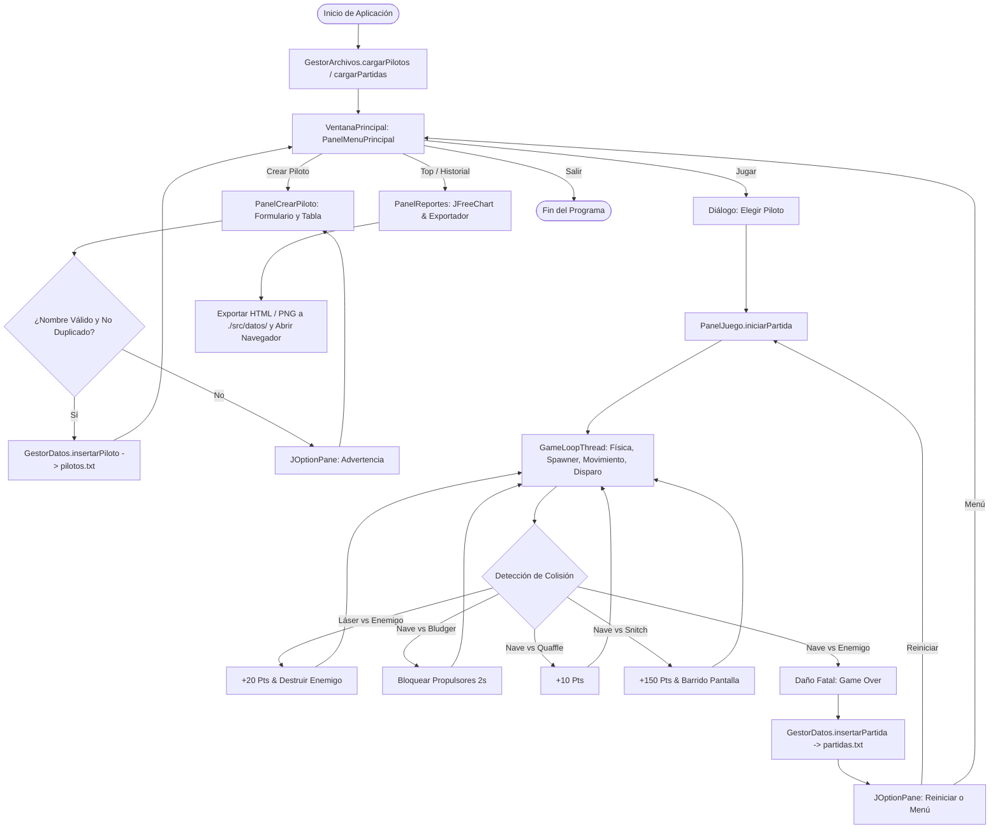
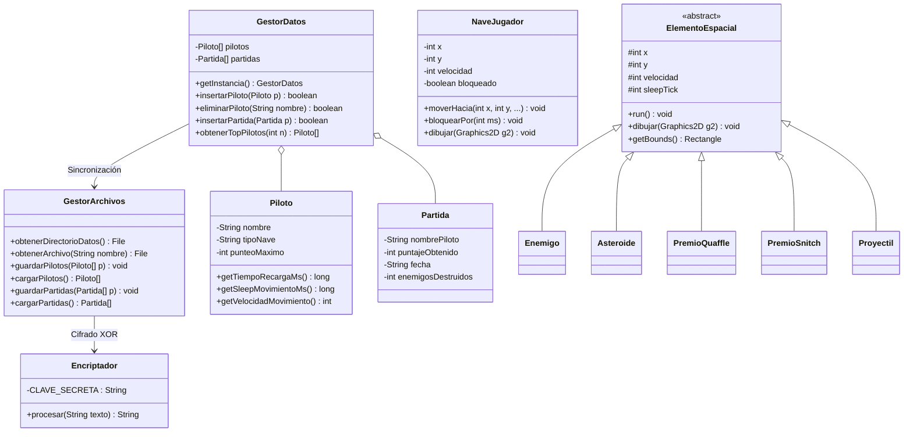

# Manual Técnico — Simulador de Vuelo Espacial 2D

Este documento describe la arquitectura de software, estructuras de datos nativas, diseño de paquetes, manejo de concurrencia e hilos, algoritmos de cifrado simétrico reversible, almacenamiento centralizado en disco y diagramas técnicos del **Simulador de Vuelo Espacial 2D (Side-Scroller)**.

---

## 1. Arquitectura General y Estructura de Paquetes

El sistema está desarrollado en **Java 21** aplicando una arquitectura por capas desacopladas, interfaz gráfica construida **100% manual en Java Swing / AWT**, gráficos estadísticos con **JFreeChart**, persistencia cifrada mediante **`java.io.*`** centralizada en la carpeta `./src/datos/` y concurrencia pura mediante **hilos nativos (`Thread` y `Runnable`)** sin el uso de colecciones dinámicas del Java Collections Framework.

```text
cris.sic.practica2
│
├── Practica2.java                         # Punto de entrada principal (Lanza VentanaPrincipal en EDT)
│
├── modelo/                                # Entidades POJO del dominio y objetos espaciales concurrentes
│   ├── Piloto.java                        # Entidad del piloto, nave asignada, velocidad y cadencias
│   ├── Partida.java                       # Entidad de partida jugada, puntajes, fechas y bajas
│   ├── NaveJugador.java                   # Nave del jugador con hilos de movimiento y disparo por dificultad
│   ├── Proyectil.java                     # Hilo independiente de proyectil láser (X_min -> X_max)
│   ├── ElementoEspacial.java              # Clase base abstracta concurrente para objetos Side-Scroller
│   ├── Enemigo.java                       # Hilo de nave enemiga (+20 pts / colisión fatal)
│   ├── Asteroide.java                     # Hilo de asteroide / Bludger (paraliza propulsores por 2s)
│   ├── PremioQuaffle.java                 # Hilo de contenedor Quaffle (+10 pts)
│   └── PremioSnitch.java                  # Hilo de Snitch Espacial (+150 pts y onda de barrido)
│
├── datos/                                 # Capa de almacenamiento y persistencia de datos
│   ├── GestorDatos.java                   # Repositorio central en memoria (Singleton y vectores nativos)
│   └── GestorArchivos.java                # Persistencia física en disco (.txt, .png, .html en ./src/datos/)
│
├── seguridad/                             # Capa de seguridad y cifrado reversible
│   └── Encriptador.java                   # Algoritmo de cifrado simétrico reversible XOR ("QuetzalKey2026")
│
└── vista/                                 # Interfaces de usuario con Swing y bucles de juego concurrentes
    ├── TemaEspacial.java                  # Paleta cromática espacial, tipografías y bordes neón
    ├── VentanaPrincipal.java              # Ventana JFrame principal (1000x600 px, CardLayout)
    ├── PanelMenuPrincipal.java            # Menú interactivo (Jugar, Crear Piloto, Top, Historial, Salir)
    ├── PanelCrearPiloto.java              # Formulario de registro de pilotos, validaciones y tabla en vivo
    ├── PanelJuego.java                    # Lienzo gráfico del simulador espacial Side-Scroller en 2D
    ├── GameLoopThread.java                # Hilo de física y renderizado continuo (~60 FPS)
    ├── SpawnerThread.java                 # Hilo generador concurrente de enemigos y premios
    └── PanelReportes.java                 # Visualización de reportes (Top 10 e Historial) y exportador HTML/PDF
```

---

## 2. Estructuras de Datos y Vectores Nativos

En cumplimiento estricto del estándar académico, el almacenamiento no utiliza `ArrayList`, `HashMap` ni estructuras dinámicas de frameworks externos. Todos los datos se gestionan mediante **vectores nativos de Java** con redimensionamiento dinámico automático al doble de capacidad gestionados por `GestorDatos.java` y `PanelJuego.java`:

| Entidad / Estructura | Arreglo Nativo | Capacidad Inicial | Factor de Expansión | Contador Auxiliar |
| :--- | :--- | :---: | :---: | :--- |
| **Pilotos Registrados** | `Piloto[] pilotos` | 2 | $\times 2$ (Doble) | `int contadorPilotos` |
| **Historial de Partidas** | `Partida[] partidas` | 2 | $\times 2$ (Doble) | `int contadorPartidas` |
| **Proyectiles Activos** | `Proyectil[] proyectiles` | 64 | $\times 2$ (Doble) | `int totalProyectiles` |
| **Elementos Espaciales** | `ElementoEspacial[] elementos` | 60 | Fija (Buffer cíclico) | `int totalElementos` |
| **Campo Estelar (Parallax)**| `Estrella[] estrellas` | 120 | Fija | N/A (Indexación directa) |

### Algoritmo de Ordenamiento para el Top de Pilotos
Para determinar el Salón de la Fama sin usar librerías de terceros, `GestorDatos.obtenerTopPilotos(int limite)` implementa un algoritmo de ordenamiento de burbuja descendente sobre copias exactas del vector nativo:

$$\text{Complejidad Temporal: } O(n^2) \quad | \quad \text{Complejidad Espacial: } O(n)$$

---

## 3. Manejo de Concurrencia e Hilos (Threads)

El simulador implementa un ecosistema multihilo cooperativo mediante `java.lang.Thread` y `java.lang.Runnable`, garantizando sincronización segura (`synchronized`) para evitar condiciones de carrera (*race conditions*):

```text
                               ┌─────────────────────────────┐
                               │       GameLoopThread        │ (Renderizado y física a 60 FPS)
                               └──────────────┬──────────────┘
                                              │
               ┌──────────────────────────────┼──────────────────────────────┐
               ▼                              ▼                              ▼
  ┌─────────────────────────┐   ┌───────────────────────────┐   ┌──────────────────────────┐
  │  HiloMovimientoJugador  │   │   HiloDisparoContinuo     │   │      SpawnerThread       │
  │ (Sleep según dificultad)│   │ (Cadencia por dificultad) │   │ (Generación periódica)   │
  └─────────────────────────┘   └─────────────┬─────────────┘   └────────────┬─────────────┘
                                              │                              │
                                              ▼                              ▼
                                 ┌────────────────────────┐    ┌───────────────────────────┐
                                 │   Proyectil (Threads)  │    │ ElementoEspacial (Threads)│
                                 │ (X_min -> X_max)       │    │ (X_max -> X_min)          │
                                 └────────────────────────┘    └───────────────────────────┘
```

### 3.1 `GameLoopThread` (Bucle Principal de Física y Renderizado)
* **Frecuencia:** Ejecución constante a $\sim 60$ fotogramas por segundo mediante `Thread.sleep(16)`.
* **Lógica del Mapa Side-Scroller:**
  * Avanza las capas de estrellas del fondo hacia la izquierda ($X_{\text{máx}} \to X_{\text{mín}}$) con velocidades parallax diferenciadas ($1$, $2$ y $4\text{ px/tick}$).
  * Actualiza la posición y límites de la nave del jugador.
  * Ejecuta la detección de colisiones mediante `Rectangle.intersects()`.
  * Compacta y limpia proyectiles y objetos destruidos o fuera de pantalla ($X \le 0$).
  * Notifica a Swing para repintar el panel con `repaint()`.

### 3.2 Hilos del Jugador (`HiloMovimientoJugador` e `HiloDisparoContinuo`)
* **`HiloMovimientoJugador`:** Desplaza la nave según las teclas presionadas (`WASD`, flechas o arrastre de ratón). La velocidad de muestreo está condicionada por el `sleep()` de la nave.
* **`HiloDisparoContinuo`:** Gestiona el fuego automático al mantener presionada la barra espaciadora, bloqueando nuevos disparos hasta que transcurra el tiempo de recarga asignado.

### 3.3 Hilos de Proyectiles Láser (`Proyectil`)
* Cada proyectil disparado se instancia como un hilo independiente que viaja de izquierda a derecha ($X_{\text{mín}} \to X_{\text{máx}}$) a una velocidad de $14\text{ px/tick}$ con `sleep(16)`.
* Al salir del límite derecho ($X \ge 1000$) o colisionar, el hilo conmuta su bandera `activo = false` y finaliza su ejecución.

### 3.4 `SpawnerThread` (Generador Concurrente de Amenazas y Premios)
* Genera elementos en el borde derecho ($X = 1000$) a intervalos pseudoaleatorios con la siguiente distribución probabilística:
  * 🛸 **Enemigo (Nave Hostil):** $60\%$
  * 🪨 **Asteroide (Bludger):** $25\%$
  * 📦 **Contenedor Quaffle:** $12\%$
  * 🟡 **Snitch Espacial:** $3\%$

### 3.5 Configuración de Dificultades y Tiempos de `sleep()`
La dificultad seleccionada al registrar el piloto altera los tiempos de reposo en milisegundos (`sleep`) de los hilos de movimiento y disparo:

| Tipo de Nave | Nivel de Dificultad | Velocidad Desplazamiento | `sleep()` Hilo Movimiento | `sleep()` Hilo Disparo / Cadencia | Perfil Táctico |
|---|---|---|---|---|---|
| **Explorador** | Fácil | $10\text{ px/frame}$ | **`12 ms`** (Ultra ágil) | **`2000 ms`** ($2.0\text{ s}$) | Gran maniobrabilidad para novatos; cadencia de disparo lenta. |
| **Caza Estelar** | Normal | $7\text{ px/frame}$ | **`25 ms`** (Equilibrado) | **`1000 ms`** ($1.0\text{ s}$) | Balance ideal entre agilidad y poder destructivo. |
| **Acorazado** | Difícil | $4\text{ px/frame}$ | **`50 ms`** (Pesado/Lento) | **`300 ms`** ($0.3\text{ s}$ - Ráfaga) | Blindaje pesado y lentitud; ráfagas devastadoras. |

---

## 4. Persistencia en Disco y Capa de Seguridad Cifrada

### 4.1 Ubicación Centralizada de Archivos (`./src/datos/`)
Para mantener la estructura del proyecto limpia y portable, **todos los archivos generados y leídos en tiempo de ejecución se administran dentro del directorio centralizado `./src/datos/`**:

```text
Practica2/
└── src/
    └── datos/
        ├── pilotos.txt             # Registros de pilotos cifrados en formato CSV
        ├── partidas.txt            # Historial de partidas cifradas en formato CSV
        ├── reporte_grafica.png     # Gráfica estadística exportada en alta definición (PNG)
        ├── reporte_partidas.html   # Reporte web estilizado con tablas y CSS espacial
        └── reporte.html            # Copia homologada del reporte HTML
```

* **Creación Automática:** La clase [`GestorArchivos.java`](./src/main/java/cris/sic/practica2/datos/GestorArchivos.java) verifica la existencia del directorio mediante `File.exists()`; si no existe, invoca `File.mkdirs()` antes de efectuar operaciones de lectura o escritura.

### 4.2 Algoritmo de Cifrado Simétrico Reversible XOR
Implementado en [`Encriptador.java`](./src/main/java/cris/sic/practica2/seguridad/Encriptador.java):
* **Clave Secreta:** `"QuetzalKey2026"`
* **Fundamento Matemático:** La operación bit a bit XOR ($\oplus$) es involutiva:
  $$(M \oplus K) \oplus K = M$$
* **Lectura y Escritura:**
  * Al guardar datos, se serializa el arreglo a CSV en texto plano, se cifra con `Encriptador.procesar(csv)` y se escribe con `BufferedWriter` y `FileWriter` de `java.io.*`.
  * Al cargar datos, se lee el texto cifrado con `BufferedReader` y `FileReader`, y al aplicar la misma rutina `Encriptador.procesar(cifrado)` se descifra a texto plano para reconstruir las entidades.

---

## 5. Diagramas del Sistema

### 5.1 Diagrama de Flujo del Simulador Espacial
El siguiente diagrama modela el ciclo de vida del juego, desde la navegación por el menú hasta la ejecución del bucle de batalla y la persistencia de resultados:




### 5.2 Diagrama de Clases del Sistema


---

## 6. Generador de Reportes y Gráficas JFreeChart

Implementado en [`PanelReportes.java`](./src/main/java/cris/sic/practica2/vista/PanelReportes.java):
1. **Top 10 de Puntajes (`BarChart`):** Generado con `ChartFactory.createBarChart`, renderizado con paleta espacial oscura (`#0B0E17`, `#1E88E5`, bordes `#00E5FF`).
2. **Evolución de Puntajes (`XYLineChart`):** Gráfico de series temporales que proyecta la evolución del desempeño del jugador partida tras partida.
3. **Exportación a Disco:**
   * Genera `reporte_grafica.png` a $800 \times 420$ px con `ImageIO.write()`.
   * Genera `reporte_partidas.html` (y `reporte.html`) mediante `PrintWriter` y `FileWriter` con CSS espacial incrustado.
   * Abre automáticamente el navegador web mediante `Desktop.getDesktop().browse()`, permitiendo exportar a PDF mediante `Ctrl + P`.

---

## 7. Instrucciones de Compilación y Ejecución

```bash
# 1. Compilar todo el proyecto con dependencias de JFreeChart
javac -classpath "libs/*" -d target/classes $(find src/main/java -name "*.java")

# 2. Ejecutar la aplicación
java -classpath "target/classes:libs/*" cris.sic.practica2.Practica2
```
