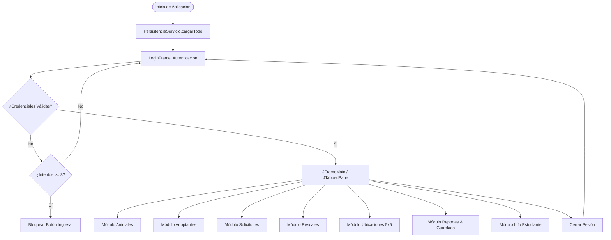
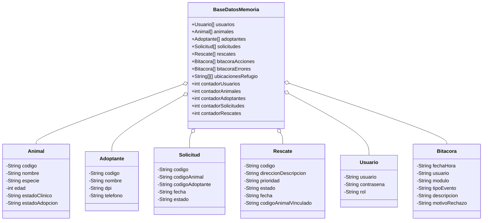

# Manual Técnico - Sistema de Gestión de Refugio de Animales

Este documento describe la arquitectura de software, estructuras de datos, diseño de paquetes, reglas de negocio, algoritmos y diagramas técnicos del Sistema de Gestión de Refugio de Animales (Proyecto 1).

---

## 1. Arquitectura General y Estructura de Paquetes

El sistema está desarrollado en **Java 21** utilizando una arquitectura modular por capas desacopladas, interfaz gráfica construida **100% manual en Java Swing** y almacenamiento en memoria basado en **arreglos estáticos de objetos y matrices bidimensionales** (sin el uso de colecciones dinámicas del Java Collections Framework).

```
cris.sic.refugio
│
├── Main.java                          # Punto de entrada y orquestador de persistencia inicial
│
├── modelo/                            # Entidades POJO del dominio
│   ├── Usuario.java                   # Entidad de usuario y roles
│   ├── Animal.java                    # Entidad de animal rescatado
│   ├── Adoptante.java                 # Entidad de adoptante registrado
│   ├── Solicitud.java                 # Entidad de solicitud de adopción
│   ├── Rescate.java                   # Entidad de caso de rescate urgente
│   └── Bitacora.java                  # Entidad de registro de eventos y errores
│
├── persistencia/                      # Repositorio global de datos en memoria
│   └── BaseDatosMemoria.java          # Arreglos estáticos, matriz 5x5 y contadores auxiliares
│
├── servicio/                          # Lógica de negocio, validaciones y persistencia
│   ├── AutenticacionServicio.java     # Autenticación y control de sesión
│   ├── AnimalServicio.java            # CRUD y filtros de animales
│   ├── AdoptanteServicio.java         # CRUD y validaciones de adoptantes
│   ├── SolicitudServicio.java         # Flujo de solicitudes y aprobación automática
│   ├── RescateServicio.java           # Gestión de prioridades y atención de rescates
│   ├── UbicacionServicio.java         # Control de la matriz 5x5 del refugio
│   ├── BitacoraServicio.java          # Registro de acciones, rechazos y errores
│   ├── PersistenciaServicio.java      # Lectura/escritura en archivos planos (.txt)
│   └── ReporteHtmlServicio.java       # Motor de exportación y generación de reportes HTML
│
└── vista/                             # Interfaces de usuario con Swing manual
    ├── LoginFrame.java                # Pantalla de acceso y control de intentos
    ├── JFrameMain.java                # Ventana principal y contenedor JTabbedPane
    ├── AnimalPanel.java               # Panel de gestión de animales
    ├── AdoptantePanel.java            # Panel de gestión de adoptantes
    ├── SolicitudPanel.java            # Panel de solicitudes de adopción
    ├── RescatePanel.java              # Panel de rescates urgentes
    ├── UbicacionPanel.java            # Panel visual interactivo de la matriz 5x5
    ├── ReportePanel.java              # Panel de generación de reportes y persistencia
    └── EstudiantePanel.java           # Panel de información del estudiante y proyecto
```

---

## 2. Estructuras de Datos y Arreglos Estáticos

En cumplimiento estricto del estándar académico, el almacenamiento no utiliza `ArrayList`, `HashMap` ni estructuras dinámicas. Todos los datos se gestionan mediante arreglos de tamaño fijo y contadores enteros auxiliares en `BaseDatosMemoria.java`:

| Entidad / Estructura | Arreglo / Matriz | Capacidad Máxima | Contador Auxiliar |
| :--- | :--- | :---: | :--- |
| **Usuarios** | `Usuario[] usuarios` | 100 | `int contadorUsuarios` |
| **Animales** | `Animal[] animales` | 100 | `int contadorAnimales` |
| **Adoptantes** | `Adoptante[] adoptantes` | 100 | `int contadorAdoptantes` |
| **Solicitudes** | `Solicitud[] solicitudes` | 100 | `int contadorSolicitudes` |
| **Rescates** | `Rescate[] rescates` | 100 | `int contadorRescates` |
| **Bitácora Acciones** | `Bitacora[] bitacoraAcciones` | 1000 | `int contadorBitacoraAcciones` |
| **Bitácora Errores** | `Bitacora[] bitacoraErrores` | 1000 | `int contadorBitacoraErrores` |
| **Matriz de Ubicaciones** | `String[][] ubicacionesRefugio` | $5 \times 5$ (25 celdas) | N/A (Indexación directa `[f][c]`) |

### Justificación Técnica de la Matriz de Ubicaciones (5x5)
La matriz `ubicacionesRefugio` representa espacialmente las celdas físicas del refugio. Permite acceso directo $O(1)$ mediante coordenadas de fila ($0$ a $4$) y columna ($0$ a $4$). Cada celda almacena el código único del animal (`A-xxx`) o `null` si se encuentra libre.

---

## 3. Validaciones Clave y Reglas de Negocio

### Formatos Estrictos de Entrada
1. **Códigos de Entidad:**
   * Animales: `A-xxx` (ej. `A-001`).
   * Adoptantes: `AD-xxx` (ej. `AD-001`).
   * Solicitudes: `S-xxx` (ej. `S-001`).
   * Rescates: `R-xxx` (ej. `R-001`).
2. **DPI de Adoptantes:** 13 dígitos numéricos exactos (`validarDpi`).
3. **Teléfono de Adoptantes:** 8 dígitos numéricos exactos (`validarTelefono`).
4. **Edad de Animales:** Valor entero en el rango $0 \le \text{edad} \le 25$.

### Reglas de Control y Transición de Estados
* **Autenticación:** Tras 3 intentos fallidos consecutivos, el botón de ingreso se bloquea (`LoginFrame`).
* **Baja Lógica de Animales:** El estado cambia a `ELIMINADO`. Los animales eliminados no se pueden reutilizar, no aparecen en búsquedas regulares ni reportes activos, y liberan de inmediato su celda en la matriz.
* **Aprobación de Solicitudes:**
  * Al aprobar una solicitud (`APROBADA`), el animal cambia automáticamente su estado a `ADOPTADO`.
  * La celda del animal en la matriz se libera de inmediato (`UbicacionServicio.liberarAnimal`).
  * Todas las demás solicitudes pendientes para ese mismo animal cambian automáticamente a `RECHAZADA`.
* **Atención de Rescates:** Al atender un caso, se puede vincular un animal existente o generar uno nuevo con código secuencial libre `A-xxx`, estableciendo su estado clínico en `EN_TRATAMIENTO`.
* **Asignación en Matriz:** Solo permite asignar animales que existan en el sistema, que no estén eliminados y que no estén adoptados. Si un animal ya ocupaba otra celda, se reubica automáticamente.

---

## 4. Persistencia de Datos y Generación de Reportes

### Persistencia en Archivos Planos (`.txt`)
Los datos se serializan y deserializan mediante métodos en `PersistenciaServicio.java` utilizando el delimitador de tubería (`|`):
* `usuarios.txt`: `usuario|contrasena|rol`
* `animales.txt`: `codigo|nombre|especie|edad|estadoClinico|estadoAdopcion`
* `adoptantes.txt`: `codigo|nombre|dpi|telefono`
* `solicitudes.txt`: `codigo|codigoAnimal|codigoAdoptante|fecha|estado`
* `rescates.txt`: `codigo|direccionDescripcion|prioridad|estado|fecha|codigoAnimalVinculado`
* `ubicaciones.txt`: `fila|columna|codigoAnimal`
* `bitacora_acciones.txt` y `bitacora_errores.txt`: Eventos con marca temporal `yyyy-MM-dd HH:mm:ss`.

### Generador de Reportes HTML
Implementado en `ReporteHtmlServicio.java`, produce documentos HTML con diseño CSS moderno incrustado sin dependencias externas:
1. `reporte_animales.html`: Listado de animales activos y estadísticas de adopción.
2. `reporte_adopciones.html`: Detalle de solicitudes procesadas y resumen por estados.
3. `reporte_ocupacion.html`: Tabla visual de la matriz $5 \times 5$ con celdas coloreadas y porcentaje de ocupación.
4. `reporte_bitacora_acciones.html`: Historial completo de operaciones y motivos de rechazo.
5. `reporte_bitacora_errores.html`: Registro de intentos fallidos y excepciones capturadas.

---

## 5. Diagramas del Sistema

### 5.1 Diagrama de Flujo del Menú Principal
El flujo general de navegación y control de usuarios se encuentra modelado en los diagramas elaborados en la carpeta `Diagrama/`:
* Archivo de imagen: `Diagrama/PrimeraVersion.png`
* Archivo vectorial: `Diagrama/PrimeraVersion.svg`
* Archivo editable: `Diagrama/PrimeraVersion.excalidraw`



### 5.2 Diagrama de Clases del Sistema


### 5.3 Diagrama de la Matriz de Ubicaciones (5x5)
```
      Col 0       Col 1       Col 2       Col 3       Col 4
   +-----------+-----------+-----------+-----------+-----------+
F0 | [A-001]   |  LIBRE    |  LIBRE    | [A-004]   |  LIBRE    |
   +-----------+-----------+-----------+-----------+-----------+
F1 |  LIBRE    | [A-002]   |  LIBRE    |  LIBRE    |  LIBRE    |
   +-----------+-----------+-----------+-----------+-----------+
F2 |  LIBRE    |  LIBRE    | [A-003]   |  LIBRE    |  LIBRE    |
   +-----------+-----------+-----------+-----------+-----------+
F3 |  LIBRE    |  LIBRE    |  LIBRE    |  LIBRE    |  LIBRE    |
   +-----------+-----------+-----------+-----------+-----------+
F4 |  LIBRE    |  LIBRE    |  LIBRE    |  LIBRE    |  LIBRE    |
   +-----------+-----------+-----------+-----------+-----------+
```
