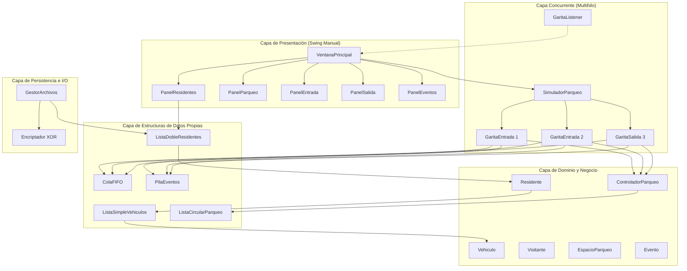
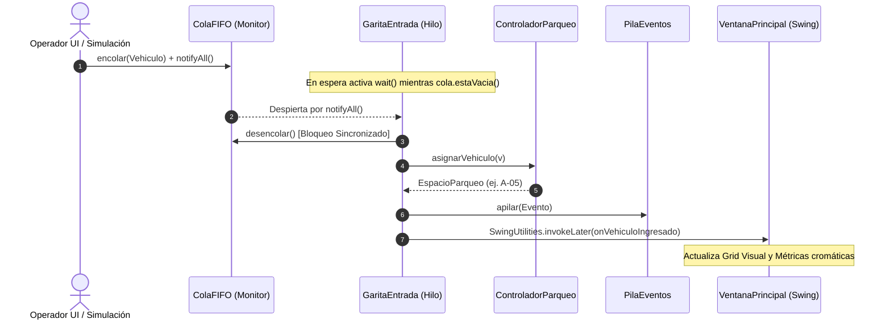

# 📘 Manual Técnico - Sistema ResiPark
**Proyecto 2 — Laboratorio de Introducción a la Programación y Computación 1**  
*Desarrollado bajo los estándares de ingeniería y calidad del MyAstron Framework*

---

## 1. Información General y Objetivos
**ResiPark** es una solución integral de software de escritorio construida en Java SE para la gestión automatizada, simulación concurrente multihilo y asignación inteligente de espacios de parqueo en residenciales privados.

### Objetivos Técnicos Principales:
- **Estructuras Dinámicas Propias:** Implementación de listas enlazadas dobles, simples, circulares, colas FIFO y pilas LIFO con gestión directa de punteros y nodos en memoria, sin utilizar colecciones de `java.util.*` ni arreglos dinámicos para los modelos de datos.
- **Concurrencia y Multihilo Sincronizado:** Simulación de 2 garitas de entrada y 1 garita de salida ejecutándose como hilos independientes en segundo plano (`java.lang.Thread`), comunicándose mediante monitores sincronizados (`synchronized`, `wait()`, `notifyAll()`).
- **Interfaz Gráfica Manual en Java Swing:** Maquetación sin constructores visuales WYSIWYG, con arquitectura basada en `CardLayout`, `BorderLayout`, `GridLayout` y paleta visual Dark Dashboard.
- **Persistencia Segura y Cifrado XOR:** Almacenamiento directo mediante `java.io.*` (FileReader/FileWriter/BufferedReader/BufferedWriter) utilizando el delimitador pipe `|` y cifrado simétrico reversible.

---

## 2. Arquitectura del Sistema

El sistema implementa una arquitectura desacoplada en 6 capas especializadas:



---

## 3. Especificación de Estructuras Dinámicas en Memoria

> [!IMPORTANT]
> Queda estrictamente garantizado el principio **Zero Java Collections**: ningún paquete de `java.util.List`, `ArrayList`, `LinkedList`, `HashMap`, `Queue` o `Stack` fue empleado en el modelo.

### 3.1 Lista Doblemente Enlazada (`ListaDobleResidentes.java`)
- **Nodos:** [`NodoDoble.java`](file:///home/cris_sic/Desktop/00.%20IPC1-2s26/Proyecto2/src/main/java/cris/sic/proyecto2/estructuras/NodoDoble.java) con punteros bidireccionales `siguiente` y `anterior`.
- **Complejidad:** Inserción $O(1)$ al final, búsqueda y eliminación $O(n)$ por identificador único.
- **Regla de Integridad:** Bloqueo de eliminación y cambio de condición de socio si algún vehículo del residente no se encuentra en estado `FUERA`.

### 3.2 Lista Simplemente Enlazada (`ListaSimpleVehiculos.java`)
- **Nodos:** [`NodoSimple.java`](file:///home/cris_sic/Desktop/00.%20IPC1-2s26/Proyecto2/src/main/java/cris/sic/proyecto2/estructuras/NodoSimple.java).
- **Restricción:** Máximo 3 vehículos por residente. Cada inserción valida unicidad global de placa.

### 3.3 Lista Enlazada Circular (`ListaCircularParqueo.java`)
- **Nodos:** [`NodoCircular.java`](file:///home/cris_sic/Desktop/00.%20IPC1-2s26/Proyecto2/src/main/java/cris/sic/proyecto2/estructuras/NodoCircular.java).
- **Topología:** Anillo cerrado donde el último nodo apunta a la cabeza.
  - **Área Socios:** 75 espacios (Filas A, B, C; 25 espacios cada una).
  - **Área General:** 75 espacios (Filas E, F, G, H, I; 15 espacios cada una). *No existe fila D*.
- **Puntero Circular de Asignación:** Almacena `ultimoAsignado`. La siguiente búsqueda inicia en `ultimoAsignado.getSiguiente()`, recorriendo un máximo de 75 pasos antes de retornar saturación.

### 3.4 Colas FIFO y Pila LIFO (`ColaFIFO.java`, `PilaEventos.java`)
- **ColaFIFO:** Encolado en cola (`fin`) y desencolado sincronizado en cabeza (`frente`).
- **PilaEventos:** Inserción LIFO en cima para la bitácora de auditoría, implementando método de recorrido no destructivo `recorrer()` para renderizado en tabla Swing.

---

## 4. Modelo de Concurrencia y Sincronización Multihilo

El sistema orquesta 3 hilos concurrentes continuos:
- **GaritaEntrada 1:** Atiende la cola común de entrada.
- **GaritaEntrada 2:** Atiende concurrentemente la cola común de entrada sin generar duplicidad de asignaciones.
- **GaritaSalida 3:** Atiende la cola de vehículos que solicitan egreso, liberando los espacios en el parqueo.



### Prevención de Deadlocks y Condiciones de Carrera:
1. **Patrón While-Wait:** La verificación de condiciones de espera se ejecuta invariablemente dentro de bucles `while (cola.estaVacia() && ejecutando) { cola.wait(); }`.
2. **Monitores Dedicados:** La cola de entrada y la cola de salida actúan como objetos de bloqueo independientes, evitando bloqueos cruzados entre entradas y salidas.
3. **Despacho Seguro en EDT:** Todos los callbacks hacia la UI se canalizan mediante `SwingUtilities.invokeLater(...)`.

---

## 5. Persistencia en Disco y Cifrado XOR

### Formato de Archivo Pipe-Delimited (`src/datos/`):
- `src/datos/residentes.txt`: `ID|Nombre|Casa|EsSocio`
- `src/datos/vehiculos.txt`: `Placa|Marca|Modelo|Color|Tipo|IDResidente`

### Algoritmo de Cifrado Simétrico:
$$\text{CaracterCifrado}_i = \text{CaracterOriginal}_i \oplus \text{ClaveSimétrica}_i$$
Permite cifrar y descifrar con la misma clave reversible sin dependencias externas.

---

## 6. Instrucciones de Compilación y Ejecución

### Requisitos:
- Java Development Kit (JDK) 17 o superior (probado en OpenJDK 21).

### Compilación limpia:
```bash
cd Proyecto2
javac -d target/classes $(find src/main/java -name "*.java")
```

### Ejecución de Pruebas Unitarias Automatizadas (Fases 1 a 9):
```bash
java -cp target/classes cris.sic.proyecto2.Proyecto2
```

### Ejecución de la Interfaz Gráfica ResiPark:
```bash
java -cp target/classes cris.sic.proyecto2.vista.VentanaPrincipal
```

### Empaquetado en JAR Ejecutable:
```bash
jar cfe target/ResiPark.jar cris.sic.proyecto2.vista.VentanaPrincipal -C target/classes .
java -jar target/ResiPark.jar
```
